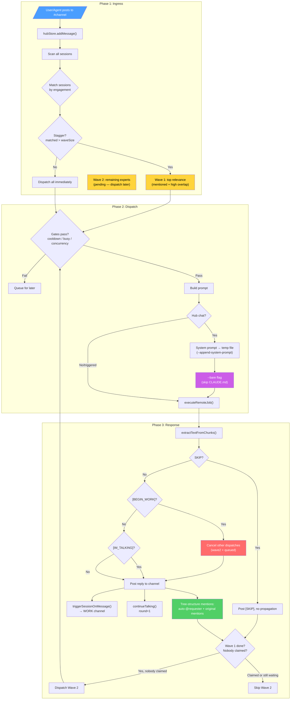
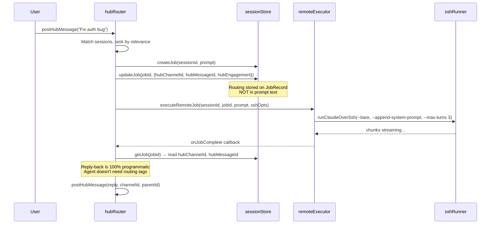
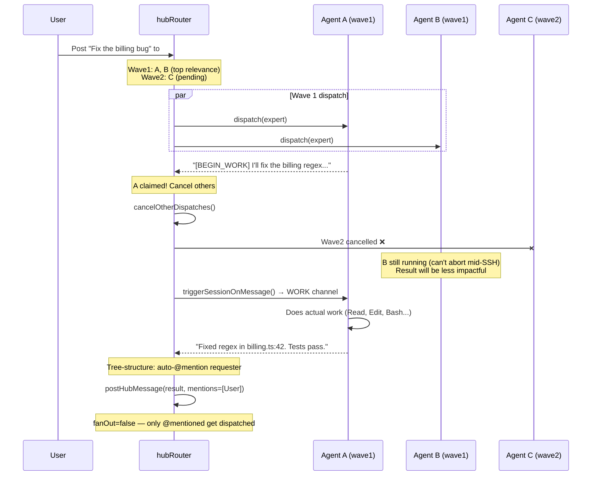
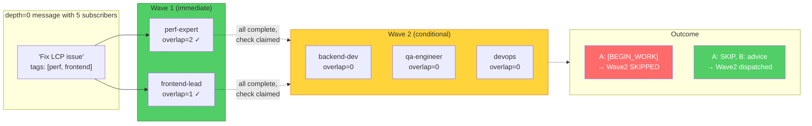
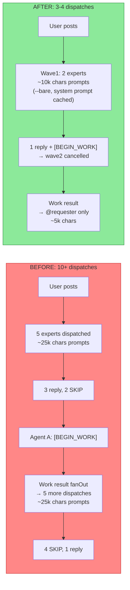

# Message Flow: Hub Channels ↔ Sessions

## Overview

Messages flow through three phases: **Ingress** (matching & queuing), **Execution** (job runs on tmux/SSH), and **Response** (output processed, chain propagation).

## Architecture Diagrams (Mermaid)

### Full Hub Message Lifecycle



### Programmatic Routing (C2) — No Prompt Tags



### [BEGIN_WORK] Flow with Cancellation (A3)



### Staggered Dispatch Waves (A2)



### Token Savings: Before vs After



---

## Phase 1: Ingress — Message Posted to Channel

```
User/Agent posts message to #channel
         │
         ▼
  postHubMessage()          ← hubRouter.ts
         │
         ├─ hubStore.addMessage()     store with id, depth, tags, parentId
         ├─ broadcast HUB_MESSAGE     dashboards see it immediately
         │
         ▼
  SCAN all sessions
         │
         ├─ Filter: type='remote', has machineId, not self
         │
         ├─ Compute engagement level + interest overlap count per session:
         │    @mentioned by name       → 'mentioned'
         │    @all + subscribed        → 'mentioned'
         │    interest∩tags + subscribed → 'expert' (overlap=N)
         │    subscribed but no overlap → 'listen'
         │
         ├─ Apply dispatch rules:
         │    1. @mentioned            → ALWAYS dispatched (any depth)
         │    2. @all + subscribed     → dispatched as 'mentioned'
         │    3. fanOut + subscribed   → dispatched (listen→expert)
         │    4. depth=0 + expert      → dispatched
         │    5. depth>0 no fanOut     → ONLY @mentions
         │    6. listen                → NEVER auto-dispatched
         │
         ├─ A2: Stagger if depth=0 and matched > hubWaveSize (default 2):
         │    Wave 1: mentioned + top-N by interest overlap → dispatch now
         │    Wave 2: remaining → stored in pendingWave2, dispatched after
         │            wave1 completes IF nobody [BEGIN_WORK]'d
         │
         ▼
  dispatchOrQueue() per matched session
         │
         ├─ Gate: cooldown (hubCooldownMs, 10s)
         ├─ Gate: session busy on 'hub' channel
         ├─ Gate: global concurrency (hubMaxConcurrentJobs, 10)
         │
         ├─ Any gate fails → queueForSession()
         │    └─ Appended to session.hubQueue[]
         │    └─ Broadcast JOB_QUEUED
         │
         └─ All gates pass → dispatchToSession()
```

### Engagement Levels

| Level | When | Behavior |
|---|---|---|
| `triggered` | Manual trigger or [BEGIN_WORK] self-trigger | Must act. Full tool access. Uses WORK channel. |
| `mentioned` | @name or @all | Must respond. 2-5 sentences. |
| `expert` | Interest tags overlap message tags | Should give opinion/advice. Can [BEGIN_WORK]. |
| `listen` | Subscribed but no tag overlap | Never auto-dispatched. @mention to pull in. |

---

## Phase 2: Dispatch — Building the Prompt & Executing

```
dispatchToSession(session, hubMessage, engagement)
         │
         ├─ Build role header:
         │    "[ROLE: billing-expert]" or "[AGENT: alice]"
         │    + custom rolePrompt if set
         │
         ├─ Build channel context (buildChannelContext):
         │    ├─ Channel history (sibling messages, 600 chars/msg cap)
         │    ├─ Thread ancestors (root → parent chain, 4000 char cap)
         │    ├─ Tasks/Docs snapshot (open bJira, recent bConfluence)
         │    └─ [IM_TALKING] hint if talking continuation
         │
         ├─ Build guidance (per engagement):
         │    Global: BE BRIEF, ONE EXECUTOR, NO TOOLS IN CHAT, SKIP IF IRRELEVANT
         │    triggered: "Do actual work, use tools, wrap in [CHANNEL_REPLY]"
         │    mentioned: "Answer in 2-5 sentences"
         │    expert: "Give opinion/advice in 2-5 sentences"
         │    listen: "SKIP unless blocking concern"
         │
         ├─ Frame source header:
         │    Normal:       "[HUB #channel from alice]"
         │    Self-trigger: "YOU SAID THIS and marked it for self-execution"
         │    Manual trigger: "YOU WERE TRIGGERED TO ACT ON THIS MESSAGE"
         │
         ├─ Assemble final prompt:
         │    TRIGGERED: <rolePrompt> + "Task from #channel (name):" + content
         │              + "Your output will be auto-posted back."
         │    CHAT:      [ROLE: ...]\n<rolePrompt>\n[CHAT CONTEXT]\n
         │              [source header]\n<content>\n---\n<guidance>
         │
         ├─ B1: System prompt file (--append-system-prompt):
         │    Static role + guidance → SFTP temp file → prompt cached by API
         │
         ├─ Create JobRecord on session.jobs[]
         ├─ C2: Store hub routing on JobRecord:
         │    { hubChannelId, hubMessageId, hubEngagement }
         ├─ Add dispatch record (status='running')
         ├─ runningHubJobs++
         ├─ Register onJobComplete callback
         │
         └─ executeRemoteJob(sessionId, jobId, prompt, channel, sshOpts)
              B2: Hub chat → --bare (skip CLAUDE.md)
              B4: Hub chat → --max-turns 3; work → --max-turns 25
```

### Execution in remoteSessionExecutor

```
executeRemoteJob(sessionId, jobId, prompt, channel='hub')
         │
         ├─ If session busy on this channel → queue & return
         │
         └─ runJob() async
              │
              ├─ machine.persistentMode = true?
              │    │
              │    ├─ YES (tmux path):
              │    │    ├─ clearTmuxSession() for hub channel
              │    │    │    (prevents context pollution from prior jobs)
              │    │    ├─ ensureTmuxSession(suffix='-hub')
              │    │    │    creates banana-{sid8}-hub tmux session
              │    │    ├─ sendPromptViaTmux()
              │    │    │    SFTP temp file → load-buffer → paste-buffer → Enter
              │    │    └─ streamTmuxOutput()
              │    │         polling capture-pane every 250ms
              │    │         diff screens → new lines → TmuxOutputParser
              │    │         auto-approve permissions
              │    │         completion: prompt '>' reappears or idle timeout
              │    │
              │    └─ NO (SSH --print path):
              │         ├─ Auto-compact if lastInputTokens >= threshold
              │         └─ runClaudeOverSsh(--print, --resume, --model)
              │              stream-json output → chunks
              │
              ├─ Per chunk: store in sessionStore + broadcast OUTPUT_CHUNK
              │
              └─ finally:
                   ├─ Mark job finished (exitCode, durationMs)
                   ├─ Broadcast OUTPUT_DONE
                   ├─ Free execution slot
                   ├─ fireCompletionCallbacks() → onSessionJobComplete()
                   ├─ drainSessionQueue() (per-channel FIFO)
                   └─ drainGlobalQueue() (unblock other sessions)
```

---

## Phase 3: Response Processing

```
onSessionJobComplete(sessionId, jobId, hubMessage, engagement)
         │
         ├─ runningHubJobs--
         ├─ extractTextFromChunks(chunks, { skipToolOutput: true })
         │    prefers stream deltas → assistant snapshots → result fallback
         │    skips tool_use blocks (insideTool flag)
         │    skips thinking_delta chunks
         │
         ▼
    ┌─ SKIP Detection ──────────────────────────────────┐
    │  parseSkipResponse(rawOutput):                     │
    │    • [SKIP][#REASON] anywhere in any line          │
    │    • [SKIP] bare (no reason)                       │
    │    • "SKIP", "SKIPSKIP" (letters-only)             │
    │    • "skip: reason", "skip — reason" (legacy)      │
    │    • Empty response                                │
    │    • Hard cap: 200 chars, no multi-paragraph       │
    │                                                    │
    │  If SKIP:                                          │
    │    ├─ dispatch.status = 'skipped'                  │
    │    ├─ Post [SKIP][#REASON] to channel              │
    │    └─ NO chain propagation                         │
    └────────────────────────────────────────────────────┘
         │ (not SKIP)
         ▼
    REAL CONTENT PATH
         │
         ├─ Detect markers (before stripping):
         │    [BEGIN_WORK] / [SELF_TRIGGER] / [ACT_NOW] → wantsSelfTrigger
         │    [IM_TALKING] / [IM_THINKING]               → wantsTalking
         │    (self-trigger takes priority over talking)
         │    (neither allowed if engagement='triggered')
         │
         ├─ Strip markers from display text
         ├─ Extract artifact actions ([bJIRA_CREATE], [bCONF_WRITE], etc.)
         ├─ Apply actions (create/update tasks & docs)
         │
         ├─ Determine display content:
         │    [CHANNEL_REPLY]...[/CHANNEL_REPLY] → use wrapped content only
         │    Otherwise → full stripped text
         │
         ├─ Extract @mentions from reply text
         │
         ├─ C1: Programmatic reply-back — triggered jobs ALWAYS post:
         │    If extractTextFromChunks empty → fallback to raw chunks/placeholder
         │
         ├─ A1: Tree-structure mentions (triggered results):
         │    Auto-@mention original requester + original message's @mentions
         │    fanOut=false — only mentioned agents get dispatched (not everyone)
         │
         ├─ Post reply to channel:
         │    postHubMessage({
         │      from: sessionId,
         │      parentId: originalMessage.id,
         │      depth: originalMessage.depth + 1,
         │      fanOut: false,                     ← A1: tree-structure, not broadcast
         │      mentions: [...agent's @names, requester, original mentions]
         │    })
         │    This RECURSES → only mentioned sessions get dispatched
         │
         ├─ Mark dispatch.status = 'acted'
         │
         │  ┌─ At depth limit (hubMaxChainDepth=5)? ────┐
         │  │  Reply still posted. But:                  │
         │  │  • Self-trigger suppressed                 │
         │  │  • Talking continuation suppressed          │
         │  │  • Message marked 'complete' immediately   │
         │  └────────────────────────────────────────────┘
         │
         ├─ [BEGIN_WORK] detected?
         │    ├─ A3: cancelOtherDispatches() — cancel queued + wave2
         │    └─ setImmediate → triggerSessionOnMessage()
         │         ├─ Bypass cooldown
         │         ├─ engagement='triggered'
         │         ├─ execChannel='work' (separate tmux session)
         │         ├─ Full tool access
         │         └─ Loop guard: triggered jobs can't self-trigger
         │
         ├─ A2: checkWave2Dispatch() — if all wave1 done + nobody claimed → dispatch wave2
         │
         └─ [IM_TALKING] detected?
              └─ setImmediate → continueTalking(round=1)
                   ├─ Re-invoke same agent with context
                   ├─ Reply posts as SIBLING (same parent, same depth)
                   ├─ If [IM_TALKING] in response → continue round+1
                   └─ Hard cap: hubMaxTalkRounds (default 10)
```

---

## Special Flows

### [BEGIN_WORK] Self-Trigger

```
Agent in HUB chat includes [BEGIN_WORK] in reply
         │
         ▼
Reply posted to channel (marker stripped)
         │
         ▼
triggerSessionOnMessage(sessionId, replyId)
         │
         ├─ Check: work channel busy? → queue with engagement='triggered'
         ├─ Check: global concurrency? → queue
         │
         └─ dispatchToSession(engagement='triggered')
              │
              ├─ Prompt: "YOU WERE TRIGGERED TO ACT ON THIS MESSAGE"
              ├─ Guidance: "Do actual work, use tools"
              ├─ execChannel = 'work'
              │
              └─ executeRemoteJob(channel='work')
                   │
                   ├─ tmux: uses WORK session (banana-{sid8}, no suffix)
                   │         context preserved, NOT cleared
                   │
                   └─ Job completes → onSessionJobComplete()
                        │
                        ├─ C1: ALWAYS posts result (fallback if empty)
                        ├─ A1: fanOut=false, auto-@mention requester
                        │   → only requester + original @mentions dispatched
                        │
                        └─ Loop guard: engagement='triggered'
                             → wantsSelfTrigger always false
                             → can't self-trigger again
```

### @all Mention

```
Message with @all in mentions
         │
         ▼
Every subscribed session matched with engagement='mentioned'
         │
All dispatch rules apply (cooldown, concurrency, busy)
         │
Each agent gets: "You were mentioned (@all) in #channel"
```

### Talking Continuation

```
Agent includes [IM_TALKING] in hub reply
         │
         ▼
continueTalking(sessionId, originalMsg, lastReply, round=1)
         │
         ├─ Check round < hubMaxTalkRounds (10)
         ├─ Check hub channel not busy
         ├─ Check global concurrency
         │
         ├─ Build prompt:
         │    "[CONTINUING YOUR TRAIN OF THOUGHT round X/Y]"
         │    Context anchored on agent's last reply
         │
         ├─ Execute on 'hub' channel
         │
         └─ onTalkingJobComplete():
              ├─ SKIP? → exit loop
              ├─ [IM_TALKING] again? → continueTalking(round+1)
              ├─ Post as SIBLING (same parent, same depth)
              └─ No marker? → exit loop naturally
```

### Manual Trigger (Dashboard ▶ Button)

```
User clicks ▶ Trigger on a message, picks session
         │
         ▼
POST /api/hub/messages/:id/trigger { sessionId }
         │
         ▼
triggerSessionOnMessage(sessionId, messageId)
         │
Same flow as [BEGIN_WORK] self-trigger but:
  • engagement = 'triggered'
  • Bypasses cooldown
  • Routes to WORK channel
  • Agent prompt: "YOU WERE TRIGGERED TO ACT ON THIS MESSAGE"
```

---

## Tmux Session Architecture

Each banana session with `persistentMode=true` gets **two** tmux sessions:

```
banana-{sid8}         WORK session (suffix='')
  ├─ Direct API sends (POST /sessions/:id/send)
  ├─ [BEGIN_WORK] triggered jobs
  ├─ Context persists across jobs
  ├─ NOT auto-cleared
  └─ Full tool access

banana-{sid8}-hub     HUB session (suffix='-hub')
  ├─ Hub dispatches (chat replies)
  ├─ Talking continuations
  ├─ Auto-cleared before each dispatch
  ├─ Stateless (fresh context each time)
  └─ Chat-only guidance (no tool use)
```

Both share the same machine (SSH connection) but are isolated processes.

---

## Queue System

### Per-Session Queue (remoteSessionExecutor)
```
pendingQueue Map<key, PendingJob[]>
  key = "sessionId"       for work channel
  key = "sessionId:hub"   for hub channel

FIFO ordering guarantees causality.
Drained in finally block AFTER job completes.
Abort clears both queues.
```

### Hub Queue (per session, persisted)
```
session.hubQueue: QueuedMessage[]
  { hubMessageId, queuedAt, engagement }

Populated when dispatch gates fail (cooldown/busy/concurrency).
Drained by processQueue() → drainGlobalQueue() after any job completes.
Messages already acted on by this session are skipped.
```

### Global Concurrency
```
hubMaxConcurrentJobs = 10 (config)
runningHubJobs counter tracks active hub dispatches.
drainGlobalQueue() walks all sessions after any completion.
```

---

## Data Structures

### HubMessage (hubStore)
```
id            UUID
channelId     string
from          sessionId or userId
fromName      display name
content       message text
tags          string[]          inherited from parent
mentions      string[]          extracted @names
parentId      UUID?             reply threading
depth         number            0=user, 1+=agent
status        pending|dispatched|complete
dispatches    [{                one per targeted session
  sessionId, jobId,
  status: queued|running|skipped|acted|error|aborted,
  startedAt?, finishedAt?
}]
```

### SessionRecord (hub-related fields)
```
role          string?           "billing-expert"
screenName    string?           "bob" — used for @mentions
interests     string[]?         tag matching for engagement
rolePrompt    string?           custom system prompt
channels      string[]?         subscribed channel IDs
model         string?           "opus", "sonnet", etc.
hubQueue      QueuedMessage[]   pending hub dispatches
```

---

## Key Config Values

| Config | Default | Env Var | Purpose |
|---|---|---|---|
| `hubMaxChainDepth` | 5 | — | Max reply depth before suppressing propagation |
| `hubMaxConcurrentJobs` | 10 | — | Global cap on parallel hub dispatches |
| `hubCooldownMs` | 10000 | — | Min time between dispatches to same session |
| `hubMaxTalkRounds` | 10 | — | Max talking continuation rounds |
| `hubWaveSize` | 2 | `BANANA_HUB_WAVE_SIZE` | Max sessions in wave1 (A2 staggered dispatch) |
| `hubChatMaxTurns` | 3 | `BANANA_HUB_CHAT_MAX_TURNS` | Max agentic turns for hub chat (B4) |
| `sshMaxTurns` | 25 | `BANANA_SSH_MAX_TURNS` | Max agentic turns for work sessions (B4) |
| `compactTokenThreshold` | 500000 | `BANANA_COMPACT_TOKEN_THRESHOLD` | Auto-compact when context exceeds this (0 = disable) |
| `tmuxIdleCompletionMs` | 30000 | — | Idle timeout for tmux completion detection |
| `tmuxAutoApprovePermissions` | true | — | Auto-approve permission prompts in tmux |

---

## Connection Counts (SSH)

Each tmux operation reuses a single SSH connection per function call:

| Operation | Connections |
|---|---|
| sendPromptViaTmux | 1 |
| clearTmuxSession | 1 |
| ensureTmuxSession (cache miss) | 2 |
| killTmuxSession | 1 |
| streamTmuxOutput | 1 (reused for entire poll loop) |

---

## Tag / Marker Reference

All tags are parsed from agent reply text in `onSessionJobComplete()`. They are stripped before the reply is posted to the channel (users never see raw markers).

### Control Flow Tags

#### `[SKIP][#REASON]` — Agent declines to act

**Purpose**: Signal that the agent has nothing to contribute. Saves tokens by preventing chain propagation.

**Syntax**:
```
[SKIP][#REASON]                         ← structured (preferred)
[SKIP][#REASON] Brief explanation.      ← with explanation (one sentence max)
[SKIP]                                  ← bare (no reason, stored as #SKIP)
SKIP                                    ← legacy bare form
skip: reason                            ← legacy with reason
skip — reason                           ← legacy em-dash form
```

**Valid reasons**: `OUT_OF_DOMAIN`, `NO_ACTION_NEEDED`, `DUPLICATE`, `WAITING`, or any custom tag.
Reasons can contain hyphens/spaces — normalized to underscores uppercase: `no-action-needed` → `NO_ACTION_NEEDED`.

**Detection**: `parseSkipResponse()` in hubRouter.ts. Scans each line for `[SKIP]` anywhere (not anchored to line start — tmux TUI text may surround it). Hard cap: replies >200 chars or multi-paragraph are never SKIP.

**What happens**:
1. Dispatch marked `status='skipped'`
2. Skip message posted to channel: `[SKIP][#REASON] explanation`
3. **No chain propagation** — reply does not trigger other agents
4. No self-trigger, no talking continuation

**When agents should use it**:
- Message outside their domain → `[SKIP][#OUT_OF_DOMAIN]`
- Already handled by someone → `[SKIP][#NO_ACTION_NEEDED]`
- Waiting on something → `[SKIP][#WAITING] Blocked on deploy.`
- Duplicate request → `[SKIP][#DUPLICATE]`

---

#### `[BEGIN_WORK]` / `[SELF_TRIGGER]` / `[ACT_NOW]` — Self-trigger to action

**Purpose**: Agent decides in chat that it should do the actual work. Marker triggers a second dispatch to its WORK tmux session with full tool access.

**Syntax**: Include anywhere in reply text. All three are aliases.
```
I'll fix the payment validation.

## Background — Form fails on special characters in CVV field
## Plan — 1. Read form.ts 2. Fix regex 3. Run tests
## Check — npm test passes
## Act — Report results

[BEGIN_WORK]
```

**Detection**: `detectSelfTrigger()` — regex `/\[(BEGIN_WORK|SELF_TRIGGER|ACT_NOW)\]/i`

**What happens**:
1. Marker stripped from posted reply
2. `triggerSessionOnMessage(sessionId, replyId)` called via `setImmediate`
3. Agent re-dispatched with `engagement='triggered'` on WORK channel
4. Prompt says: "YOU SAID THIS EARLIER — now actually do the work"
5. Agent runs with full tool access (Read, Edit, Write, Bash, Grep, Glob)
6. Work result posted with `fanOut=true` → ALL subscribers see it

**Guards**:
- Only valid in non-triggered dispatches (loop guard: triggered→triggered blocked)
- Suppressed at depth limit (`hubMaxChainDepth`)
- Takes priority over `[IM_TALKING]` if both present
- Respects global concurrency / cooldown / busy gates

**Agent guidance**: Include PDCA format (Background, Plan, Check, Act) before the marker so the work session has clear instructions.

---

#### `[IM_TALKING]` / `[IM_THINKING]` — Talking continuation

**Purpose**: Agent holds the floor for multiple turns without other agents interrupting. Used when actively executing multi-step work that needs sequential turns.

**Syntax**: Include anywhere in reply text. Both are aliases.
```
I've read the codebase and found the issue in auth.ts:142.
Let me trace the call chain next. [IM_TALKING]
```

**Detection**: `detectTalkingMarker()` — regex `/\[(IM_TALKING|IM_THINKING)\]/i`

**What happens**:
1. Marker stripped from posted reply
2. `continueTalking(sessionId, originalMsg, reply, round=1)` called
3. Agent re-invoked with prompt: "[CONTINUING YOUR TRAIN OF THOUGHT round X/Y]"
4. Follow-up posted as SIBLING (same parent, same depth — reads sequentially)
5. If `[IM_TALKING]` in follow-up → loop continues (round+1)
6. No marker → loop exits naturally
7. SKIP reply → loop exits

**Guards**:
- Not valid in triggered mode (triggered jobs stay focused on work)
- Not valid if `[BEGIN_WORK]` also present (self-trigger takes priority)
- Hard cap: `hubMaxTalkRounds` (default 10)
- Suppressed at depth limit

**Requirement**: Only valid when agent is actively executing tool calls. Using it to narrate reasoning without tool use is treated as SKIP.

---

#### `[CHANNEL_REPLY]...[/CHANNEL_REPLY]` — Clean work result

**Purpose**: After a triggered work session finishes, wrap the summary so only the clean result appears in the channel (not debugging output, tool narration, etc.).

**Syntax**:
```
<tool use output, debugging, etc. — NOT posted>

[CHANNEL_REPLY]
Fixed form validation in auth.ts:142. Changed regex to handle special chars.
Tests pass: 45/45 green.
[/CHANNEL_REPLY]
```

**Detection**: Parsed by `extractArtifactActions()` in channelArtifactExtractor.ts

**What happens**:
1. Text inside `[CHANNEL_REPLY]...[/CHANNEL_REPLY]` extracted
2. Only that text is posted as the channel reply
3. Everything outside the markers stays in the session but is not shown in channel
4. If marker absent → full extracted text is posted (may be noisy)

**When to use**: After `[BEGIN_WORK]` triggered work completes. Guidance tells agent: "Wrap the message you want posted in [CHANNEL_REPLY]...[/CHANNEL_REPLY]."

---

#### Programmatic Routing (C2) — replaces `[REPLY_TO_CHANNEL]`

**Purpose**: Routing metadata is now stored on the `JobRecord` itself (`hubChannelId`, `hubMessageId`, `hubEngagement`) instead of injected into the prompt. This means:

- Routing works 100% regardless of whether the agent complies with tag syntax
- Prompts are shorter (no routing tags to parse)
- `remoteSessionExecutor` detects hub-originated jobs via `jobRecord.hubChannelId` (not prompt text)
- Response routing reads from JobRecord in `onSessionJobComplete()` via closure

**Legacy**: `[REPLY_TO_CHANNEL]` tags have been removed from all prompts. Old agents that emitted them still work — banana ignores them.

---

### Artifact Tags (bJira & bConfluence)

Agents can read/write persistent shared state by including these markers in their reply. Markers are stripped before the reply is posted to the channel.

#### `[bJIRA_CREATE]...[/bJIRA_CREATE]` — Create a task

```
[bJIRA_CREATE title="Fix LCP > 4s" status=open assignee=qa-bob tags=perf,frontend priority=high]
Acceptance criteria: LCP must be < 2.5s on slow-3G.
[/bJIRA_CREATE]
```
Creates a new bJira task. Returns `bJIRA-N` ID. Attributes: `title` (required), `status`, `assignee`, `tags`, `priority`.

#### `[bJIRA_UPDATE]...[/bJIRA_UPDATE]` — Update a task

```
[bJIRA_UPDATE id=bJIRA-12 status=in_progress assignee=cas-pop]
```
Updates fields on existing task. Can include body text for notes. Attributes: `id` (required), `status`, `assignee`, `title`, `tags`, `priority`.

#### `[bJIRA_COMMENT]...[/bJIRA_COMMENT]` — Comment on a task

```
[bJIRA_COMMENT id=bJIRA-12]
Lighthouse rerun: 78 → 92. Still flaky on slow-3G.
[/bJIRA_COMMENT]
```

#### `[bCONF_WRITE]...[/bCONF_WRITE]` — Create a doc

```
[bCONF_WRITE title="Auth Spec" tags=auth,api]
# Auth Spec
Decision matrix for JWT vs session...
[/bCONF_WRITE]
```
Creates new bConfluence doc. Returns `bCONF-N` ID.

#### `[bCONF_UPDATE]...[/bCONF_UPDATE]` — Replace a doc

```
[bCONF_UPDATE id=bCONF-3 title="Auth Spec v2"]
Full replacement body. Prior version kept in history.
[/bCONF_UPDATE]
```

#### `[bCONF_APPEND]...[/bCONF_APPEND]` — Append to a doc

```
[bCONF_APPEND id=bCONF-3]
## Update 2026-04-10
Added refresh-token rotation rule.
[/bCONF_APPEND]
```

#### `[bCONF_DELETE]` — Delete a doc

```
[bCONF_DELETE id=bCONF-3]
```

**Status values** (bJira): `open`, `in_progress`, `qa_test`, `blocked`, `done`, `wontfix`
**Priority values** (bJira): `low`, `medium`, `high`

---

### Mention Tags

#### `@screenName` — Mention a specific agent

Include `@alice` in message content to force-dispatch to that session regardless of interest/engagement/depth rules. The session must have `screenName: 'alice'`.

#### `@all` — Mention all subscribers

Dispatches to ALL sessions subscribed to the channel with `engagement='mentioned'`. Use sparingly — pulls every agent into the conversation.

---

### Prompt Context Tags (System-Injected)

These appear in prompts sent to agents. Agents don't write them.

| Tag | Purpose |
|---|---|
| `[ROLE: ...]` | Agent's role from session config |
| `[AGENT: ...]` | Fallback if no role — uses screenName |
| `[HUB #channel from name]` | Normal dispatch source |
| `[CHAT CONTEXT in #channel]` | Channel history section header |
| `[CONTINUING YOUR TRAIN OF THOUGHT round X/Y]` | Talking continuation prompt |
| `[YOU SAID THIS EARLIER ... [BEGIN_WORK] ...]` | Self-trigger prompt |
| `[YOU WERE TRIGGERED TO ACT ON THIS MESSAGE]` | Manual trigger prompt |

---

### Tag Interaction Rules

```
                    ┌─ [SKIP] detected?
                    │   YES → post skip, stop. No propagation.
                    │   NO  ↓
                    ├─ [BEGIN_WORK] detected?
                    │   YES → post reply (stripped), trigger WORK session
                    │         (takes priority over [IM_TALKING])
                    │   NO  ↓
                    ├─ [IM_TALKING] detected?
                    │   YES → post reply (stripped), continue talking loop
                    │   NO  ↓
                    └─ Normal reply → post to channel, chain propagation
```

**Priority order**: SKIP > BEGIN_WORK > IM_TALKING > normal reply

**Engagement restrictions**:
- `triggered` engagement → cannot use [BEGIN_WORK] or [IM_TALKING] (already in action mode)
- `listen` engagement → expected to [SKIP] unless blocking concern
- Depth limit → suppresses [BEGIN_WORK] and [IM_TALKING] (reply still posted)
